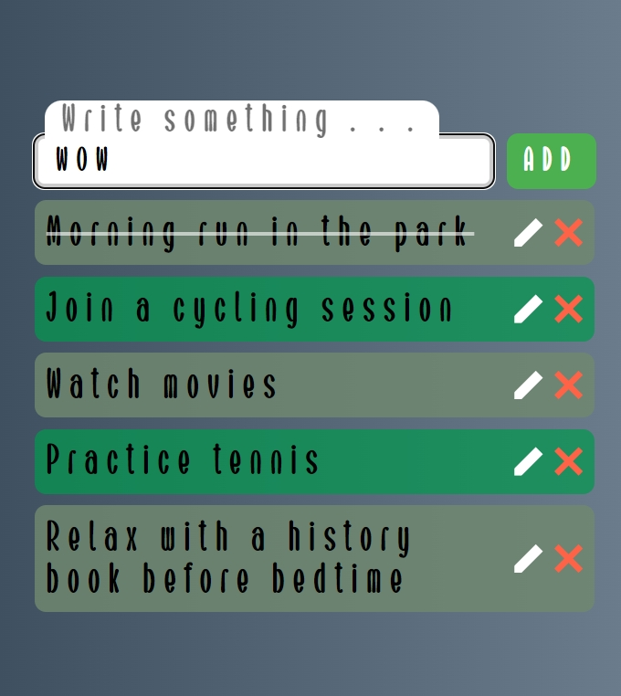

# Simple To-Do List

A basic to-do list created using HTML, CSS, and JavaScript. The list supports drag and drop functionality for easy task management. Additionally, it utilizes local storage, allowing you to save your tasks in the browser. This ensures that your data persists even when you refresh the page.

## Features
- HTML, CSS, and JavaScript
- Drag and drop for task management
- Local storage to save and retrieve tasks

Feel free to clone and customize this to-do list for your own projects!

