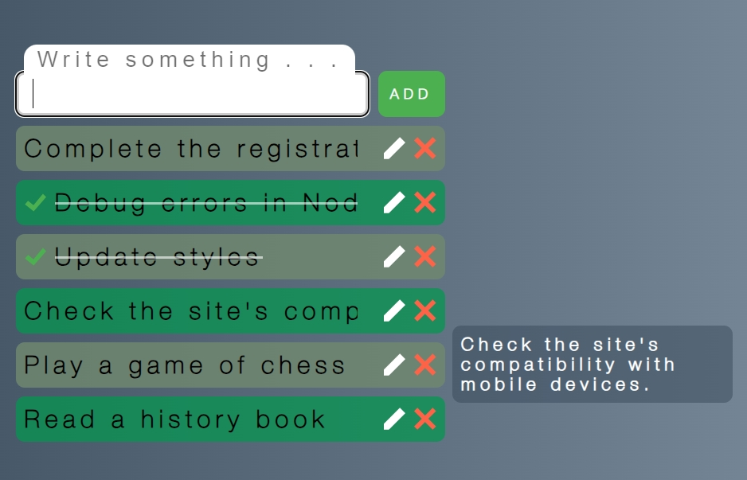

# Simple To-Do List

A basic to-do list created using HTML, CSS, and JavaScript. Additionally, it utilizes local storage, allowing you to save your tasks in the browser. This ensures that your data persists even when you refresh the page.

## Features
- HTML, CSS, and JavaScript
- Local storage to save and retrieve tasks

Feel free to clone and customize this to-do list for your own projects!

